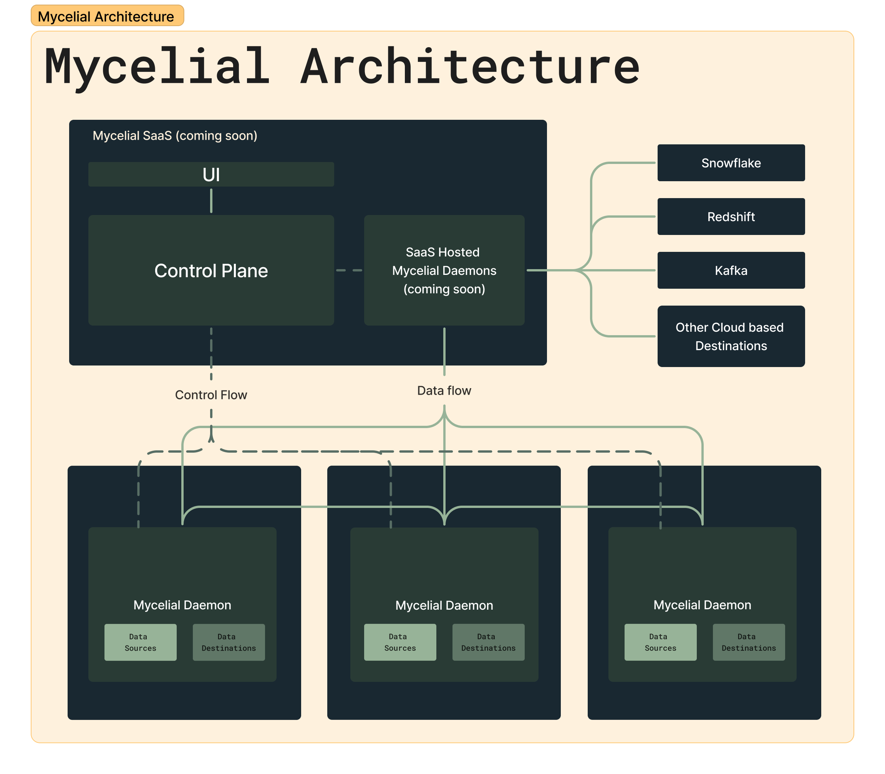

# Architecture

## Introduction

### Purpose of the Document

This document delineates the architectural framework of Mycelial Software,
detailing the structure and interaction of its components. It serves as a guide
for developers, architects, and system administrators.

### Scope of Mycelial Software

The scope encompasses three primary components: Mycelial Daemons, Mycelial
Control Plane, Connectors and Transforms. These elements work in unison to facilitate data
movement between various sources and destinations.

### Definitions, Acronyms, and Abbreviations

- **Mycelial Daemons**: Background services written in Rust, responsible for data transfer.
- **Mycelial Control Plane**: Server software for orchestrating Mycelial Daemons.
- **Connectors**: Adapters enabling data exchange between Daemons and external sources/destinations.
- **Transforms**: Data processing functions for converting data formats.
- **Rust**: A multi-paradigm programming language emphasizing safety and performance.
- **API**: Application Programming Interface.
- **UI**: User Interface.
- **Workflow**: A data movement job (pipeline), consisting of a source, destination, transforms and associated connectors.

## Overview of Mycelial Software

### High-Level Architecture

The Mycelial Software architecture is designed for robust and efficient data movement. At its core, it consists of Mycelial Daemons, the Mycelial Control Plane, Connectors and Transforms. Each component serves a distinct role:

- **Mycelial Daemons**: These are responsible for the actual movement of data. They operate in the background, handling the transportation of data to and from various sources and destinations.
- **Mycelial Control Plane**: This serves as the central command and control center for the Mycelial Daemons. It orchestrates the activities of the daemons, managing their workflows, coordination, and monitoring.
- **Connectors**: Functioning as interfaces, connectors enable the Mycelial Daemons to interact with different data sources and destinations. They are specifically tailored to handle various data formats and protocols.
- **Transforms**: These are data processing functions that convert data formats as needed. They are used to ensure compatibility between the source and destination data formats.

### Component Interaction

- **Daemon and Control Plane Interaction**: Mycelial Daemons communicate with the Control Plane to receive instructions and send operational data. This interaction is crucial for sharing available sources/destinations, creating workflows, and error reporting.
- **Daemon and Connector Interaction**: Daemons utilize Connectors to access data sources and destinations. Connectors translate the data and protocol specifics, allowing Daemons to process and move data efficiently.
- **Control Plane and Connector Management**: While the Control Plane does not directly interact with Connectors, it plays a vital role in their management. This includes creating, configuring, and updating Connectors as needed.

This overview provides a fundamental understanding of how Mycelial Software's main components function and interact within the broader system architecture.

## Mycelial Daemons

### Purpose and Functionality

Mycelial Daemons are specialized software entities designed for the movement of
data between diverse sources and destinations. Their primary function is to
ensure efficient, reliable, and secure data transfer, operating silently in the
background close to the sources and destinations.

### Architectural Design

#### Written in Rust

Mycelial Daemons are implemented in Rust, a language chosen for its performance,
safety, and concurrency capabilities. This choice ensures high efficiency in
data handling and robustness in daemon operation.

#### Data Movement Mechanism

The daemons utilize a stream-based approach for data movement, allowing for the handling of large datasets and near real-time data processing. They support various data formats and are capable of both batch and stream processing.

### Security and Authentication Mechanisms

Security in data movement is paramount. The daemons employ encryption for data
in transit and integrate authentication protocols to ensure secure communication
with data sources, destinations, and the Control Plane.

### Error Handling and Logging

Mycelial Daemons are equipped with comprehensive error handling mechanisms to manage and mitigate data transfer disruptions. They maintain detailed logs for system diagnostics, auditing, and performance monitoring, aiding in troubleshooting and optimization.

## Mycelial Control Plane

### Role and Responsibilities
The Mycelial Control Plane acts as the central orchestrator for Mycelial Daemons. It is responsible for managing the deployment, coordination, and monitoring of daemons, ensuring efficient and organized data flow.

### Architectural Design

#### Server Software Specifications

The Control Plane is designed as robust server software, capable of handling
large-scale daemon management. It operates on a scalable architecture to
accommodate varying loads and is compatible with multiple cloud and on-premises
environments. It's written in Rust, ensuring high performance and reliability.

#### Communication with Mycelial Daemons

The Control Plane communicates with daemons using a secure and efficient
protocol, facilitating the dispatch of jobs, collection of status updates, and
retrieval of performance metrics.

### Control Plane Scalability and Reliability

Scalability is a core aspect of the Control Plane design, allowing for dynamic
adjustment of resources based on the system’s workload. It ensures high
availability and fault tolerance to maintain continuous operation.

### User Interface and Accessibility

An intuitive web user interface (UI) is provided for system administrators to
interact with the Control Plane. This UI offers capabilities for configuration
management, daemon deployment, and system monitoring.

### Monitoring and Maintenance

The Control Plane includes comprehensive monitoring tools for tracking system
performance and health. It supports routine maintenance activities, including
updates and backups, ensuring system longevity and reliability.

### Security Considerations

Security in the Control Plane is multi-faceted, encompassing data encryption,
access control, and regular security audits. It adheres to industry-standard
protocols to safeguard against unauthorized access and data breaches.

## Connectors

### Definition and Role
Connectors in the Mycelial architecture are components that enable Mycelial Daemons to interface with various data sources and destinations. They play a pivotal role in translating data formats and protocols, ensuring compatibility and seamless data flow.

### Types of Connectors

#### Source Connectors
Source Connectors are designed to extract data from a variety of data sources. They handle different data retrieval methods and formats, facilitating the ingestion of data into the Mycelial system.

#### Destination Connectors
Destination Connectors manage the delivery of data to various endpoints. They ensure that the data is appropriately formatted and transmitted to the specified destinations, adhering to the destination's protocol requirements.

### Connector Architecture

#### Integration with Mycelial Daemons
Connectors are closely integrated with Mycelial Daemons, providing a seamless interface for data exchange. This integration allows for efficient data transformation and movement between the daemons and external systems.

#### Data Format and Transformation
Connectors are equipped to handle various data formats and are capable of performing necessary transformations. This flexibility ensures that data is correctly processed, regardless of its source or destination format.

### Development and Customization of Connectors
Mycelial offers a framework for developing custom connectors, enabling users to extend the system's capabilities to new data sources and destinations. 

### Performance and Optimization
Connector performance is critical for overall system efficiency. Mycelial connectors are optimized for high throughput and low latency, ensuring that data movement does not become a bottleneck in the data workflow.

## Transforms

### Definition and Functionality
Transforms in Mycelial Software are specialized functions integral to the data processing workflow. Their primary role is to modify, process, and standardize data as it moves between sources and destinations, ensuring compatibility and maintaining data integrity.

### Types of Transforms

#### Data Format Conversion
This type of transform changes the data's format to match the destination's requirements.

#### Data Enrichment
Data enrichment transforms add value to the data by including additional information, merging data from multiple sources, or computing new data fields.

#### Data Filtering and Cleansing
These transforms involve the removal of unwanted or redundant data, correction of errors, and ensuring that the data meets quality standards.

### Architecture and Integration

#### Placement in Data Workflow
Transforms are strategically placed within the data workflow, typically after data ingestion by the Mycelial Daemons and before data export to the destination.

#### Integration with Mycelial Daemons
Transforms are tightly integrated with the Mycelial Daemons, allowing for seamless data processing within the movement workflow.

### Development and Customization

#### Custom Transform Development
Mycelial offers a framework for developing custom transforms (coming soon), enabling users to tailor data processing to specific needs and scenarios.

#### Language and Tool Support
Transforms can be developed using the Python programming language (coming soon).

### Performance Considerations

#### Processing Efficiency
Transforms are optimized for minimal impact on data processing time, ensuring that data transformation does not become a bottleneck in the workflow.

#### Resource Utilization
Careful consideration is given to the resource utilization of transforms, balancing processing needs with available system resources to maintain overall system efficiency.

This section details the crucial role of Transforms in the Mycelial Software architecture, outlining their functionality, integration, development, and operational considerations. The focus is on ensuring that transforms contribute effectively to the data workflow, enhancing data compatibility, integrity, and processing efficiency.

## Data Flow and Processing

### Data Ingestion
The process of data ingestion involves the Mycelial Daemons using Source Connectors to retrieve data from various sources. This step includes:

- Identifying and connecting to data sources.
- Extracting data in the source's format.
- Preparing data for transmission to the Mycelial system.

### Data Transformation
Once data is ingested, it undergoes transformation to ensure compatibility with the destination's requirements. This process entails:

- Converting data formats as needed.
- Ensuring data integrity and consistency.

### Data Export
The final stage in the data flow process is exporting the processed data to the intended destinations. This involves:

- Using Destination Connectors to establish connections with the data destinations.
- Transmitting data in the appropriate format and protocol.
- Verifying successful delivery and handling any transmission errors.

This section outlines the sequential stages of data handling within the Mycelial system, emphasizing the integral role of Mycelial Daemons and Connectors in ensuring efficient and accurate data movement.

## Deployment and Operation

This section provides guidance on deploying and operating the Mycelial Software
system. It covers system requirements, installation procedures, configuration
steps, and operational best practices designed to ensure a smooth and efficient
setup.

### System Requirements

Before initiating the deployment, verify that your environment meets the following requirements:
- **Operating Systems**: Linux (x86, arm, arm64), Windows (x86), macOS (x86, arm64).
- **Disk Space**: At least 30MB for Mycelial Daemons and 10MB for the Mycelial Control Plane.
- **Memory**: At least 15MB of RAM for Mycelial Daemons and 10MB of RAM for the Mycelial Control Plane.
- **Network**: Ideally you should have a reliable internet or network connection for communication between components, however Mycelial is tolerant to network outages and can minimally continue to operate without a network connection and continue normal operations when the network connection is restored.

### Installation Process

1. **Download the Installation Package**: Obtain the latest version of the Mycelial software from the [CLI](../getting-started/CLI.md).
2. **Install the Software**: Execute the CLI installation command and follow the prompts to set up the Mycelial Daemons and Control Plane.
3. **Verify Installation**: Ensure the Mycelial Daemons and Control Plane services are running correctly by checking their status. If you encounter any issues, refer to the associated logs.

### Configuration and Customization

- **Daemon Configuration**: Define data sources and destinations via the [CLI](../getting-started/CLI.md) or by manually editing the Daemons `config.toml` file.
- **Mycelial Control Plane Configuration**: Access the web UI to configure the Control Plane, which largely entails connecting data sources to destinations often via transorms.

### Operational Best Practices

- **Regular Updates**: Keep the Mycelial software up-to-date by regularly checking for and applying updates and patches. This can be done using the Mycelial [CLI](../getting-started/CLI.md).
- **Performance Monitoring**: Utilize the OS monitoring tools track system performance and address any issues proactively.
- **Backup and Recovery**: Implement backup procedures for configuration files, databases, and other critical components to ensure data integrity and system recovery capabilities.

### Troubleshooting

- **Documentation and Resources**: Refer to the Mycelial documentation for troubleshooting guides, FAQ, and best practices.
- **Community and Forums**: Engage with the Mycelial community through forums, [Discord channels](https://discord.gg/mycelial), or social media for support and advice.
- **Professional Support**: For complex issues or deployment assistance, contact Mycelial for professional support services.

Deploying and operating Mycelial Software involves careful planning and adherence to the recommended practices outlined in this section. By following these guidelines, you can ensure a successful implementation and maintain an efficient, secure, and scalable data movement system.

## Security and Compliance

### Data Security Measures
Implementing robust security measures is critical to protect data within the Mycelial system. These measures include:

- Encryption of data.
- Implementation of authentication and authorization protocols.
- Regular security audits and vulnerability assessments. This can be accomplished Operating System level security tools such as SELinux, AppArmor, and others.

### Auditing and Logging
Maintaining detailed logs and audit trails is essential for security and compliance. This includes:

- Logging all access and modifications to data as appropriate.
- Providing tools for audit trail analysis and reporting.
- Using logging data to detect and respond to security incidents.

This section outlines the importance of security and compliance in the Mycelial system, detailing the measures and practices implemented to safeguard data.

## Scalability and Performance

### Performance Metrics and Benchmarks
To ensure the Mycelial system meets operational requirements, key performance metrics and benchmarks are established, including:

- Data throughput rates and processing speeds.
- Latency measurements for data movement.
- Resource utilization efficiency (CPU, memory, network).

Because Mycelial is written in Rust, it is highly efficient and has very low resource requirements. The Mycelial Daemon requires around 30MB of disk space and it usually consumes less than 15MB of RAM. The Mycelial Control Plane requires around 10MB of disk space and it usually consumes less than 10MB of RAM.

### Scalability Strategies
The Mycelial system is designed for scalability, accommodating varying data volumes and user demands. Scalability strategies include:

- Horizontal scaling through the addition of more Mycelial Daemons.
- Load balancing mechanisms for efficient resource allocation.
- Elastic resource management in cloud-based deployments.

### Load Balancing and Resource Management
Effective load balancing and resource management are critical for optimal performance. This involves:

- Distributing workloads evenly across Mycelial Daemons.
- Dynamic allocation of resources based on current workload.
- Preventing resource bottlenecks and ensuring high availability.

This section highlights the importance of scalability and performance in the Mycelial system, outlining the approaches and techniques used to maintain efficient operation under varying loads and conditions.

## Support

### Support Channels
Providing access to support resources is essential for effective problem resolution. This includes:

- Details on how to access technical support (e.g., helpdesk, online forums).
- Guidelines for submitting support tickets or requests.
- Information about community-driven support resources.

#### Support Resources

- [Mycelial Documentation](https://docs.mycelial.com/): Comprehensive documentation covering all aspects of the Mycelial system.
- [Mycelial Community](https://discord.gg/mycelial): Online community for Mycelial users to share knowledge and experiences.
- [GitHub Issues](https://github.com/mycelial/mycelial/issues): Issue tracker for reporting bugs and requesting new features.

### Updating and Patching
Regular updates and patches are vital for system security and functionality. This subsection covers:

- Procedures for updating Mycelial software to the latest version.
- Best practices for applying patches and security updates.
- Strategies for ensuring updates cause minimal disruption to operations.

#### Update and Patch Management
Mycelial software updates and patches are managed through the Mycelial [CLI](../getting-started/CLI.md). The CLI provides a simple interface for updating the Mycelial Control Plane and Daemons to the latest version.

This section serves as a comprehensive guide for troubleshooting and support, offering users the necessary resources and knowledge to address issues and maintain the Mycelial system's smooth operation.
